### 项目介绍

星云ERP基于SpringBoot框架，为中小企业提供完全开源、永久免费、用户体验好的进销存ERP系统，解决开店难、管理难、数据统计难的问题。星云ERP主要包括基础信息管理、商品中心、采购管理、销售管理、零售管理、库存管理、盘点管理、结算管理等，各业务模块均支持参数配置，满足实际遇到的各种业务场景。丰富的报表模块支持用户做各项数据分析。同时支持对部门、岗位、角色、用户、权限等进行精细化管理。最终，达到业务线上化、透明化、简易化管理的目标，实现物流、资金流、信息流的一体化管控。

#### 单体架构

集成常用的SpringBoot、MybatisPlus等框架，更利于上手使用或二次开发。

#### 关于商业使用的说明

项目使用Apache 2.0 License，编写的代码无任何闭源情况，均可免费使用。我们对商业使用行为没有限制，只需要遵循Apache2.0 License即可。

### 演示环境地址

星云ERP平台地址：http://erp.lframework.com   <a href="http://erp.lframework.com" target="_blank">
点此进入</a>

### 底层框架源码

底层框架源码：https://gitee.com/lframework/jugg   <a href="https://gitee.com/lframework/jugg" target="_blank">
点此进入</a>

### 前端项目源码

前端项目源码：https://gitee.com/lframework/xingyun-front   <a href="https://gitee.com/lframework/xingyun-front" target="_blank">
点此进入</a>

### 后端开发的一些约定
* cacheName不使用{}
* 主库的名称为master

### 关于多租户
application.yml中的tenant.enabled改为true则代表开启多租户模式；false则代表关闭多租户模式。
虽然开启和关闭多租户是由配置文件控制，但是由于两种模式数据库结构不同，不支持正在运行中的系统修改租户模式。

### 使用说明文档

星云ERP说明文档：https://www.lframework.com   <a href="https://www.lframework.com" target="_blank">点此进入</a>

### 为什么将代码分了这么多仓库？ 全部放在一个仓库里面不是更方便吗？

因为这些代码全部放在一个仓库的话，会导致这个仓库的文件占用很大，并且有些代码可能您并不需要，所以分了几个仓库，这样选择性下载代码，速度更快、体验更好。

### 系统功能

| 系统功能 | 功能描述                        |
|------|-----------------------------|
| 系统管理 | 系统设置、菜单、部门、角色、岗位、用户、操作日志    |
| 基础信息 | 仓库、供应商、客户、会员基础信息            |
| 商品中心 | 商品主数据、类目、品牌、销售属性、属性（自定义属性）  |
| 采购管理 | 采购订单、收货单、退货单                |
| 销售管理 | 销售订单、出库单、退货单                |
| 零售管理 | 零售出库单、退货单                   |
| 库存管理 | 商品库存、商品批次库存、批次库存变动记录        |
| 库存盘点 | 盘点参数设置、预先盘点单管理、盘点任务管理、盘点单管理 |
| 库存调整 | 库存成本调整                      |
| 结算管理 | 供应商费用单、预付款单、对账单、结算单、收入/支出项目 |
| 代码生成 | 生成增删改查代码                    |
| 多租户  | 支持多租户                       |

### 主要技术框架

* Springboot 2.2.2.RELEASE
* MyBatis-plus 3.4.2
* Spring-session-data-redis 2.2.0.RELEASE
* HuTool 5.7.17
* Lombok 1.18.10
* EasyExcel 2.2.10（内置了两种导出excel方式：一次性导出、分段导出（只支持简单表头））

### 开发环境

* JDK 1.8
* Mysql 5.7.18
* Redis 4.0.8（版本可以根据自己的redis进行调整，项目本身依赖Redis的功能很简单，就是两部分：缓存、Session，不会出现大的兼容问题）

### 技术交流

QQ交流群号： **717574596**

### 注意事项

项目依赖的底层框架全部封装成starter，关于这部分的代码详见：<a href="https://gitee.com/lframework/jugg" target="_blank">点此进入</a>

BPM工作流目前是整合AgileBPM工作流管理平台，由于AgileBPM的Licence是GPL，所以使用这部分功能需要遵守GPL许可证的限制条件，关于这部分的代码详见：<a href="https://gitee.com/lframework/xingyun-bpm" target="_blank">点此进入</a>，如果不使用此部分代码及功能，请忽略此条说明

### License

项目使用Apache 2.0许可证，请遵守此许可证的限制条件。

### 集成第三方库

<a href="https://gitee.com/agile-bpm/agile-bpm-basic" target="_blank">AgileBPM</a> 工作流管理平台

<a href="https://gitee.com/dromara/sa-token" target="_blank">Sa-Token</a> 统一用户鉴权

<a href="https://gitee.com/ld/J2Cache" target="_blank">J2Cache</a> 基于内存和Redis的两级Java缓存框架

<a href="https://gitee.com/xiaoym/knife4j" target="_blank">knife4j</a> knife4j是为Java MVC框架集成Swagger生成Api文档的工具

<a href="https://github.com/xaboy/form-create" target="_blank">FormCreate</a> 强大的动态表单生成器

### 系统展示

* 首页
  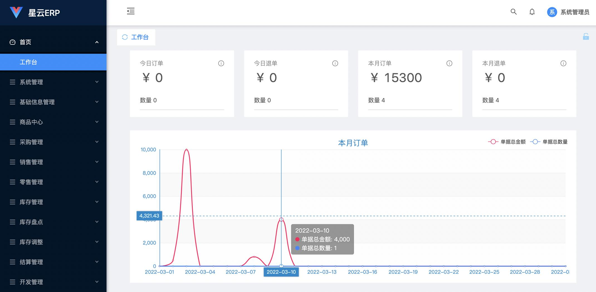
* 系统管理
  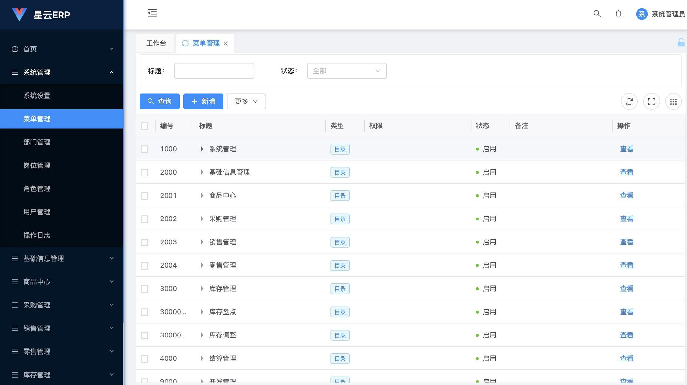
* 基础信息管理
  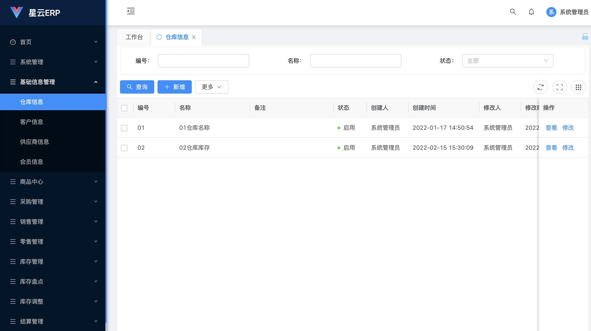
* 商品中心
  
* 采购管理
  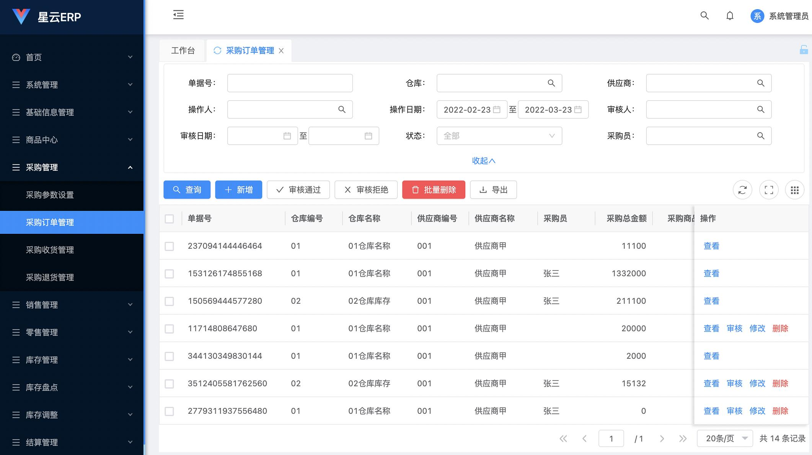
* 销售管理
  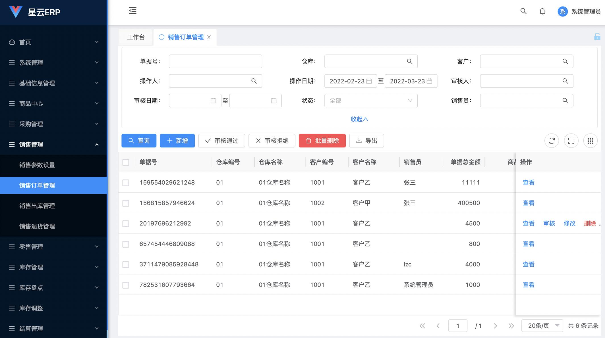
* 零售管理
  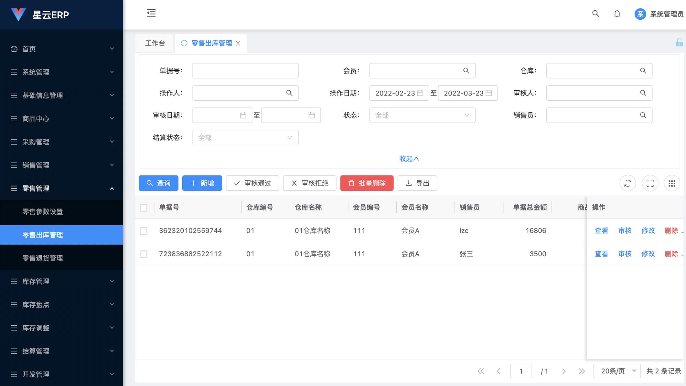
* 库存管理
  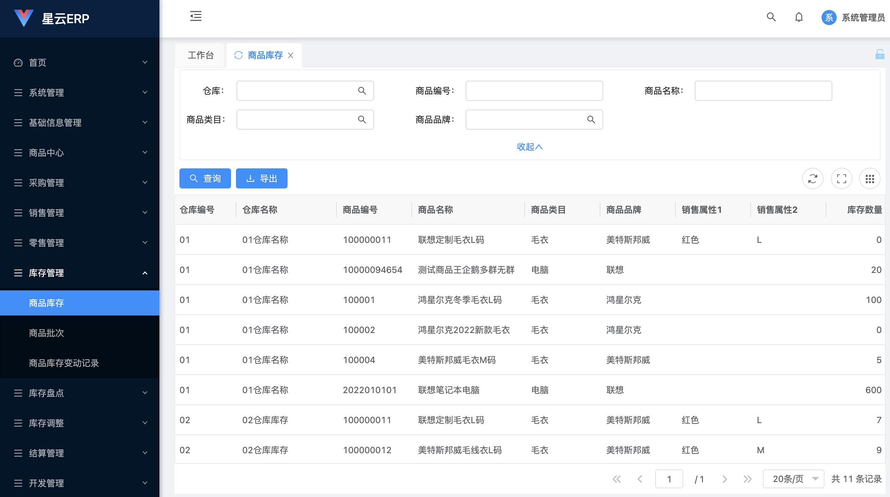
* 库存盘点
  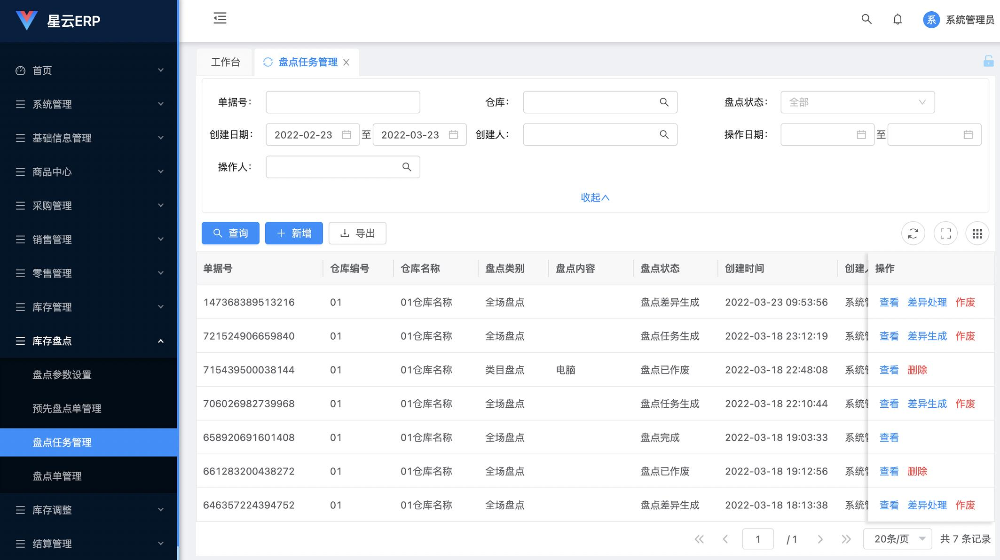
* 库存调整
  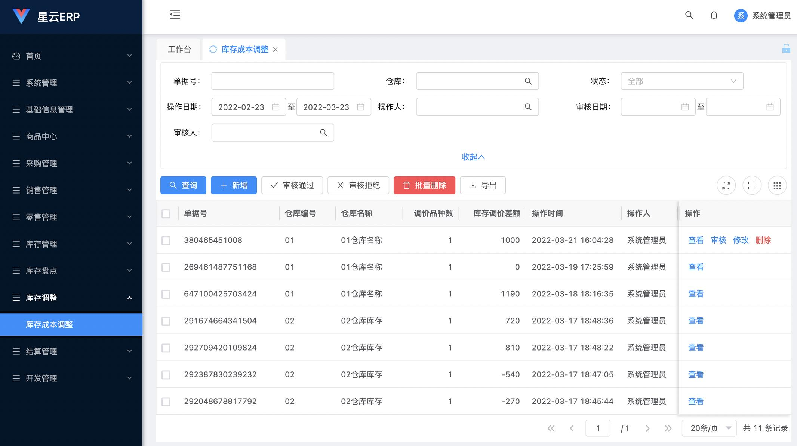
* 结算管理
  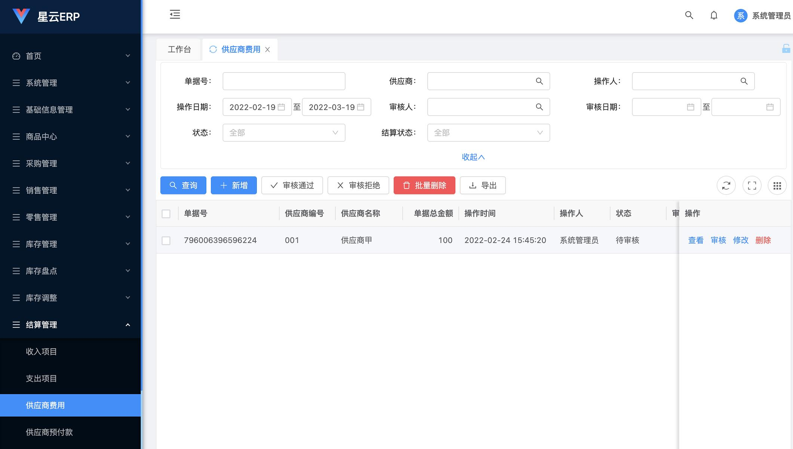
* 开发管理
  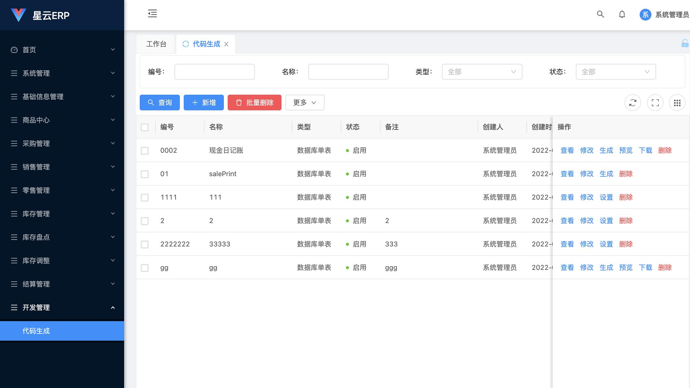

### 其他说明
作者是两只热爱工作、热爱开源的程序猿、产品经理，欢迎大家提出批评、建议！